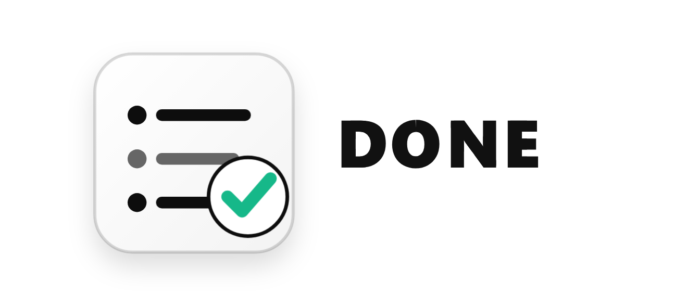

# TodoApp

TodoApp is a Windows desktop todo app with a clean Apple-inspired interface, local offline storage, subtasks, calendar view, deleted-item recovery, and soft completion animations.



## Features

- Local offline todos with no account, cloud sync, telemetry, or ads.
- Daily task view with a resizable calendar pane.
- Subtasks under parent tasks; completing all subtasks completes the parent task.
- Completed tasks fade and sink visually without deleting data.
- Deleted tasks can be viewed and restored.
- Local holiday calendar cache.
- Click the logo to play the title animation.

## Data Location

Release builds store user data here:

```text
%APPDATA%\TodoApp\todos.json
```

Holiday data is cached here:

```text
%APPDATA%\TodoApp\holidays
```

Older development builds stored data under `data/`. On first launch, TodoApp copies old local data into `%APPDATA%\TodoApp` if the new data file does not exist.

## Build

Install Python 3.12+, then run:

```powershell
powershell -ExecutionPolicy Bypass -File .\build.ps1
```

The portable executable is created at:

```text
dist\TodoApp.exe
```

## Build Installer

Install Inno Setup first:

```powershell
winget install JRSoftware.InnoSetup
```

Then build the installer:

```powershell
powershell -ExecutionPolicy Bypass -File .\build-installer.ps1 -Version 1.0.0
```

Outputs:

```text
dist\TodoAppSetup.exe
dist\TodoAppSetup.exe.sha256
```

## Code Signing

For public distribution, sign both `TodoApp.exe` and `TodoAppSetup.exe` with a trusted code-signing certificate or signing service. The local self-signed certificate used during development is not suitable for public releases.

Optional environment variables:

```powershell
$env:TODOAPP_SIGN_CERT_THUMBPRINT = "YOUR_CERT_THUMBPRINT"
$env:TODOAPP_TIMESTAMP_SERVER = "http://timestamp.digicert.com"
```

## GitHub Release

This repository is set up for GitHub Releases. Push a version tag to build release assets:

```powershell
git tag v1.0.0
git push origin main --tags
```

By default, the workflow builds unsigned CI artifacts and does not overwrite manually uploaded release assets. Set the repository secret `TODOAPP_UPLOAD_RELEASE=true` only after you have configured trusted signing for public releases.

## Privacy

See [PRIVACY.md](PRIVACY.md). TodoApp stores todos locally and does not upload user data.
